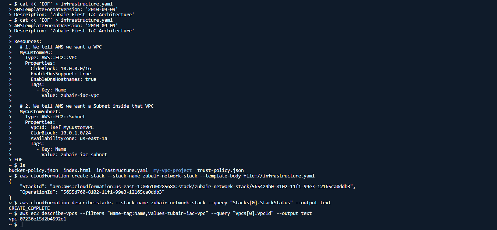

# AWS Infrastructure as Code (IaC) with CloudFormation


This repository demonstrates the use of declarative Infrastructure as Code (IaC) to provision and manage AWS networking resources. Using AWS CloudFormation and the AWS CLI, a custom Virtual Private Cloud (VPC) and Subnet were deployed and subsequently destroyed, highlighting the efficiency, repeatability, and scalability of IaC over manual imperative commands.

## Architecture Overview
* **Compute/Networking:** Amazon VPC, Amazon Subnet
* **IaC Engine:** AWS CloudFormation
* **Configuration:** YAML template utilizing intrinsic functions (`!Ref`) for dynamic resource mapping.

---

## Phase 1: Writing the IaC Template

A YAML template was created to define the desired state of the infrastructure.

```yaml
AWSTemplateFormatVersion: '2010-09-09'
Description: 'Zubair First IaC Architecture'

Resources:
  MyCustomVPC:
    Type: AWS::EC2::VPC
    Properties:
      CidrBlock: 10.0.0.0/16
      EnableDnsSupport: true
      EnableDnsHostnames: true
      Tags:
        - Key: Name
          Value: zubair-iac-vpc

  MyCustomSubnet:
    Type: AWS::EC2::Subnet
    Properties:
      VpcId: !Ref MyCustomVPC
      CidrBlock: 10.0.1.0/24
      AvailabilityZone: us-east-1a
      Tags:
        - Key: Name
          Value: zubair-iac-subnet
!Ref MyCustomVPC: An intrinsic function used to dynamically retrieve the ID of the newly created VPC and attach the Subnet to it during the build process.
Phase 2: Deploying the Stack
code
Bash
aws cloudformation create-stack --stack-name zubair-network-stack --template-body file://infrastructure.yaml
create-stack: Instructs the CloudFormation engine to read the local YAML file and provision the resources in the correct dependency order.
Phase 3: Verification
code
Bash
aws cloudformation describe-stacks --stack-name zubair-network-stack --query "Stacks[0].StackStatus" --output text
# Output: CREATE_COMPLETE

aws ec2 describe-vpcs --filters "Name=tag:Name,Values=zubair-iac-vpc" --query "Vpcs[0].VpcId" --output text
# Output: vpc-07236e15d2b4592e1
Validated that the CloudFormation stack completed successfully and that the EC2 service registered the new VPC.

Phase 4: Infrastructure Teardown
One of the primary benefits of CloudFormation is state management. Because AWS tracks the dependencies, the entire architecture can be destroyed with a single command, without needing to manually detach or delete sub-resources in a specific order.
code
Bash
aws cloudformation delete-stack --stack-name zubair-network-stack
delete-stack: Automatically resolves dependencies (e.g., deleting the Subnet before the VPC) and cleanly removes all resources defined in the stack.
code
Bash
aws ec2 describe-vpcs --filters "Name=tag:Name,Values=zubair-iac-vpc" --query "Vpcs[0].VpcId" --output text
# Output: None
Verified that the VPC was successfully destroyed and no orphaned resources were left behind.
![alt text](iac2.PNG
